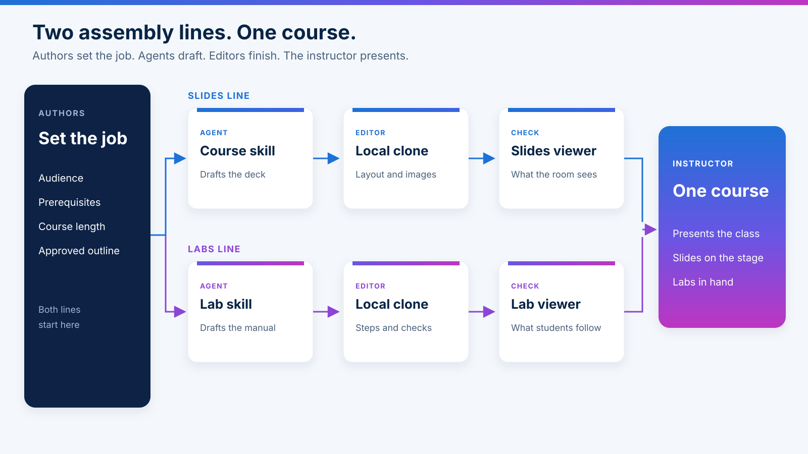
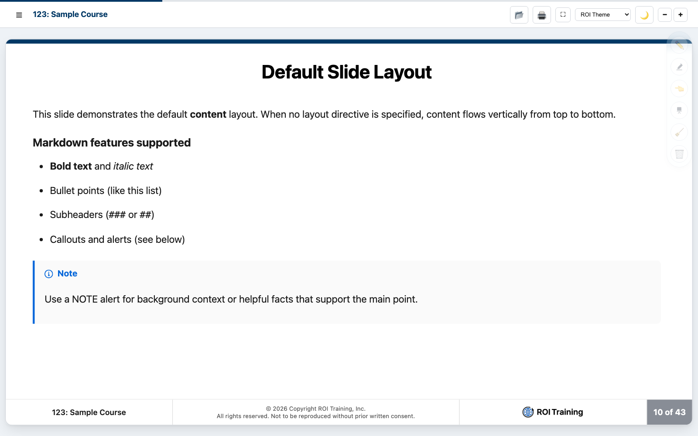
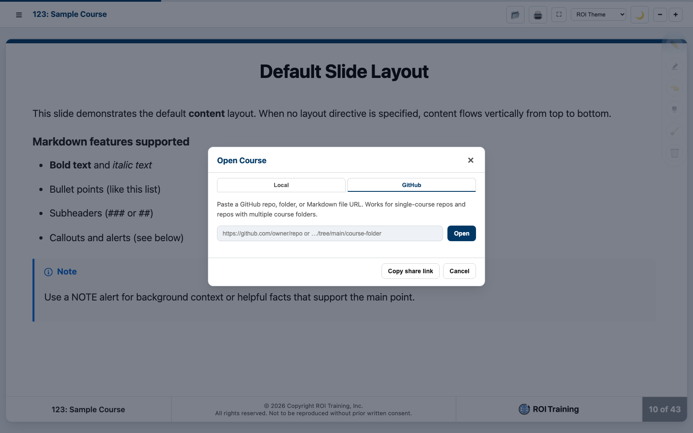
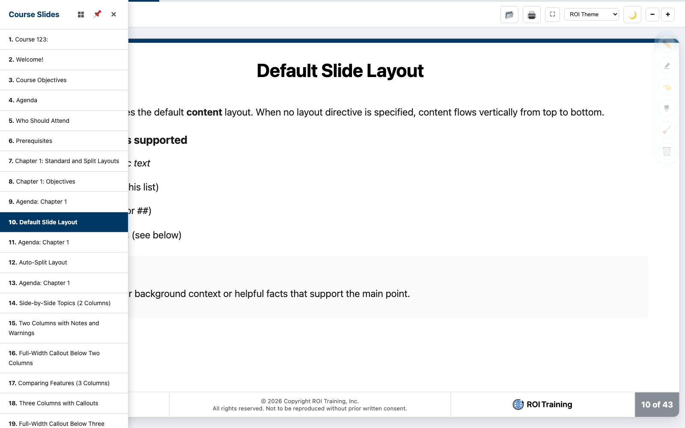
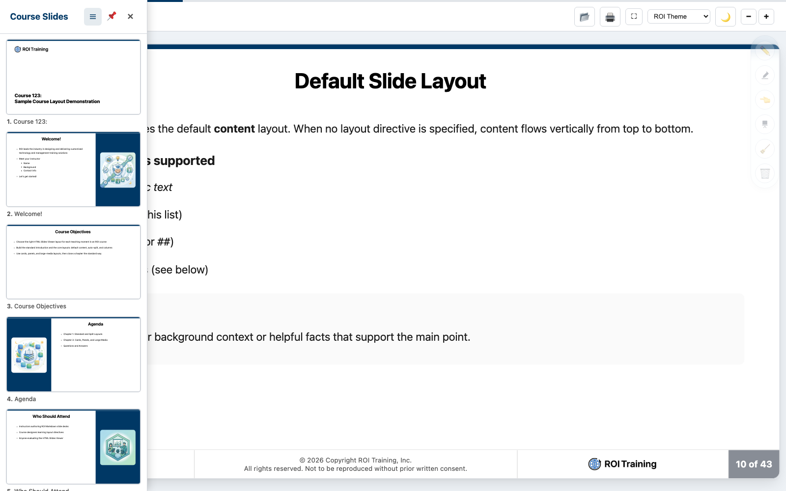
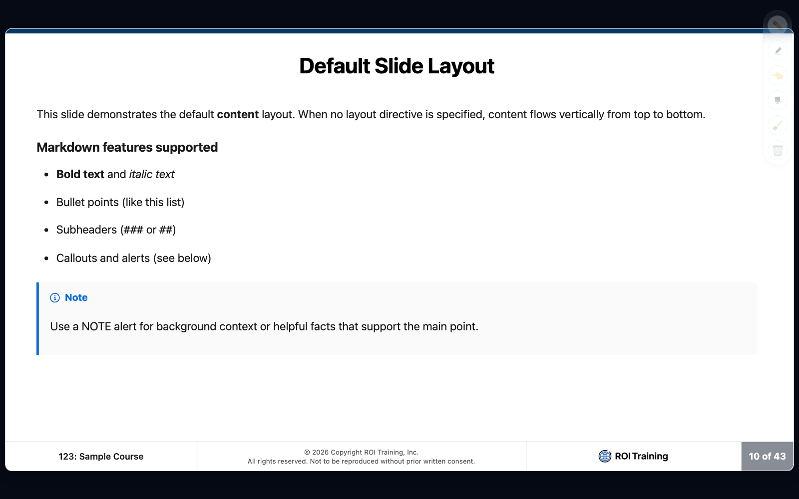
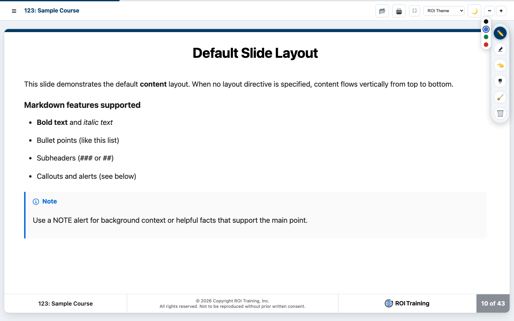
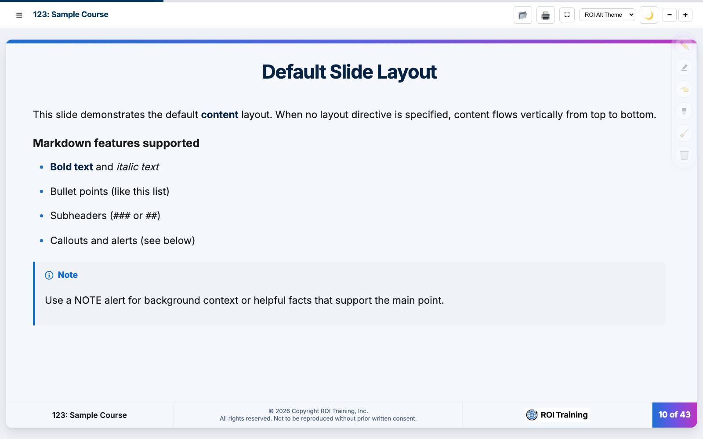
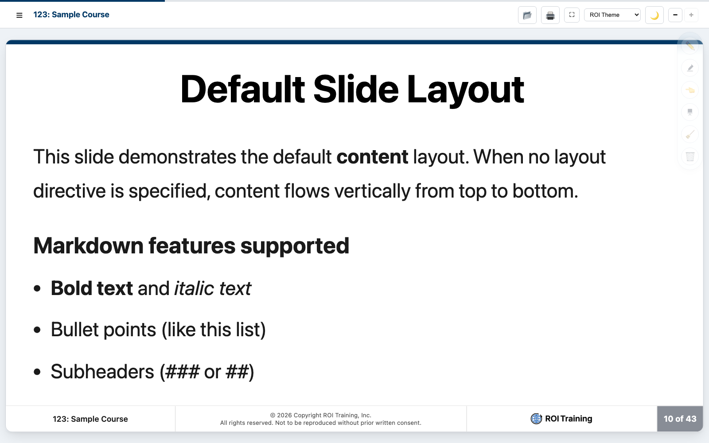
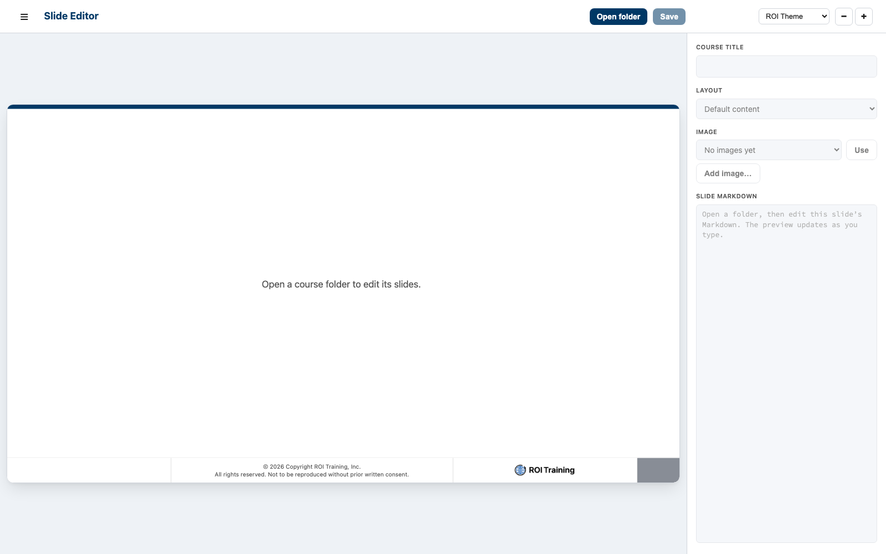

<!-- course-title: Introducing the ROI Course Factory -->

<!-- layout: title -->


Introducing the ROI Course Factory

# Chapter 1: How the Factory Works

---

# Chapter 1: Objectives

- Name the viewer, the editor, the skills, and the template, and say what each one is for
- Open a course locally or from GitHub and present it with the drawer, annotations, themes, and type size
- Edit slides on a local clone: change layouts, images, and Markdown, then save
- Start a new course from the template with a clear brief and an outline you approve

---

<!-- layout: navigation -->
# Chapter 1

- **Introduction**
- Using the Viewer
- Using the Editor
- Creating a Course

---

# One Factory, Two Lines

- **Two assembly lines** build every class: a slides line and a labs line
- **Authors** set the job on both lines: audience, prerequisites, length, and an outline they approve
- **Agents** draft from the matching skill. **Editors** finish layout, images, and wording on a local clone
- **Instructors** receive one course. They present the slides and send students into the labs

> [!NOTE]
> The lines run side by side and ship together. The room sees one class, with a deck and a lab manual.

---

<!-- layout: full-bleed -->
# Factory Lines Diagram



---


<!-- layout: card-layout -->
# Four Pieces, One Class

### Viewers
- The Slides Viewer is used by the instructor to present. 
- The Lab viewer is used by students to do the labs. 
- The viewers are read-only designed for the classroom

### Editor
- Editing staff use this to change a slide on a local clone.
- Save writes the Markdown file in that folder.

### Skills
- Course Generator and Lab Generator are the rules the agent follows.
- They keep decks and labs in the ROI shape without you restating it.

### Template
- This is the GitHub repo you clone to start a course.
- It holds the folder layout, the stock images, and the skills.

---

# The Loop You Will Actually Use

- **Brief** the agent inside a clone of the template
- **Read** the draft in the viewer, the way the room will see it
- **Fix** the slide in the editor when a layout, image, or line is wrong
- **Share** a GitHub URL so the next instructor opens the same course

> [!NOTE]
> The room never needs the editor. Instructors live in the viewer. Authors and editors live in the repo.

---

<!-- layout: 2-column -->
# What Is the Course, and What Is Just This Browser

### In the Markdown file
- Slide text, layout comments, and images
- Chapter files and the course title in the footer
- This is what you commit and what the next person opens

### Only in this browser
- Theme, light or dark, and type size
- Pen, highlighter, pointer, and flipchart
- Handy while you teach, gone for the next instructor

<!-- below-columns -->

> [!IMPORTANT]
> If it is not in the Markdown, it is not part of the course.

---

# Who Does What

- **Authors** brief the agent, approve the outline, and reject a draft that misses the audience
- **Editing staff** clone the repo and use the editor for layouts, images, and wording
- **Instructors** open the viewer and teach. They mark up the slide. They do not rewrite the file
- **Everyone** previews before the class. A slide that looks fine in the editor can still be too tall on the stage

---

<!-- layout: navigation -->
# Chapter 1

- Introduction
- **Using the Viewer**
- Using the Editor
- Creating a Course

---

# Open the Viewer

- **Start here:** [slidesv.roitraining.com](https://slidesv.roitraining.com/)
- The first load is a sample course, so you can click around before you bring your own
- The folder icon (or Command+O on a Mac, Ctrl+O on Windows) opens a course
- Nothing you do in this window writes back to GitHub

> [!TIP]
> Bookmark the viewer. You do not install it, and you do not put the viewer source in the course repo.

---

<!-- layout: stacked -->
# The Toolbar Is the Whole Console

- **Folder** opens a course. **Printer** builds a 16:9 handout
- **Fullscreen** hides this bar. **Theme** restyles the slides
- **Moon** switches light and dark. **Minus and plus** change type size
- The annotation dock sits on the slide, not in this bar



---

<!-- layout: stacked -->
# Open a Course from Your Machine

- Choose **Local**, then **Choose Folder**
- Point at the folder that holds the chapter Markdown files and `images/`
- Several Markdown files in that folder become chapters in the chapter menu
- This is a read. Closing the tab does not change the files


---

<!-- layout: stacked -->
# Open a Course from GitHub

- Choose **GitHub** and paste a repo, a folder, or a single Markdown file URL
- A folder URL is the usual choice: the viewer lists each chapter file
- **Open** loads it. **Copy share link** gives you a URL that reopens this course
- Recent GitHub courses stay on this browser so you can jump back

> [!NOTE]
> The class can follow along if the repo is readable from the viewer. A private repo they cannot fetch will not open.



---

# What the Viewer Expects in the Folder

- Chapter files named like `00-introduction.md` and `01-how-the-factory-works.md`
- The same `course-title` comment at the top of every chapter, so the footer matches
- An `images/` folder beside those files, with relative links such as `images/welcome.png`
- Slides separated by a line that contains only `---`

> [!IMPORTANT]
> Open the course folder, not a random parent directory full of unrelated Markdown. The viewer treats the Markdown it finds there as the course.

---

<!-- layout: stacked -->
# The Slide Drawer

- The hamburger opens **Course Slides**: every slide title, in order
- Click a row to jump. The current slide is highlighted
- **Pin** keeps the list open while you teach. Close it when you want the stage back
- Use this when someone asks you to return to an earlier picture



---

<!-- layout: stacked -->
# The Thumbnail Tray

- The grid icon in the drawer header switches from titles to thumbnails
- Scan the tray when you need the picture, not the title
- The list is faster when you already know the slide name
- Either view jumps to that slide. Neither one edits it



---

<!-- layout: title-image -->
# Fullscreen



---

# Present Without Hunting for the Mouse

- **Right arrow** or **Space** advances. **Left arrow** goes back. **Home** and **End** jump to the ends
- **F** toggles fullscreen. The toolbar hides. The annotation dock stays
- **P** pen, **H** highlighter, **O** pointer, **C** clear this slide
- Print from the printer icon: 16:9, margins none, background graphics on

> [!TIP]
> Fullscreen is for the room. Leave it when you need the chapter menu, the theme, or a different course.

---

<!-- layout: stacked -->
# Mark Up the Slide, Not the File

- The dock on the right is for the live class: pen, highlighter, pointer, flipchart, clear, delete all
- Pick a color, then draw. Pen colors include black, blue, green, and red
- **Clear** erases this slide. **Delete all** erases every slide in this browser
- Those strokes stay in this browser. They are not written into the Markdown



---

<!-- layout: card-layout -->
# Four Ways to Point at the Slide

### Pen
- Draw a line the room can see. Press P.
- Choose a color before you draw, or you will get the last one.

### Highlighter
- Lay a translucent stroke over a phrase. Press H.
- Yellow, green, or blue. It does not cover the words completely.

### Pointer
- Drop one pointer on the spot you mean. Press O.
- A second click moves it. You do not get a trail of pointers.

### Flipchart
- Open a blank sheet over the slide and sketch.
- Close the sheet to come back to the slide. The slide is still there.

---

<!-- layout: stacked -->
# Themes Change the Look, Not the Words

- The theme menu restyles type, color, and the title slide
- **ROI Theme** is the default classroom look. **ROI Alt Theme** is the darker, site-like look
- **Demo**, **Demo 2**, and **Holcim** are other skins for the same Markdown
- Switching themes does not edit the file, and it does not travel with a share link as content



---

<!-- layout: stacked -->
# Type Size Is for the Room You Are In

- Minus and plus shrink or enlarge the slide text
- Use it when the back row cannot read a code sample, or when a slide is cramped
- The viewer remembers the size in this browser
- It does not change the Markdown, and a colleague’s browser starts at the normal size



---

<!-- layout: navigation -->
# Chapter 1

- Introduction
- Using the Viewer
- **Using the Editor**
- Creating a Course

---

# You Edit on a Clone, Nowhere Else

- Clone the course repo first. The editor opens that folder on your machine
- It does not open a GitHub URL, and it does not commit or push
- Use **Chrome or Edge**. Other browsers cannot grant the folder write access it needs
- When you are done, commit from Git the way you already do

> [!IMPORTANT]
> The viewer is for presenting. The editor is for changing files. Do not expect Save on a course you opened from GitHub in the viewer.

---

<!-- layout: stacked -->
# What You See When the Editor Opens

- **Open folder** picks the course directory. **Save** writes the current chapter
- The stage is a live preview of the slide you are on
- The inspector on the right holds the course title, the layout, the image, and the Markdown
- Until a folder is open, those fields stay disabled on purpose



---

<!-- layout: 3-column -->
# The Inspector Does Three Jobs

### Layout
- The menu sets the layout comment for this slide
- Title, columns, cards, panels, and image layouts are all in that list
- The preview updates before you save

### Image
- **Add image** copies a file into `images/` and places it on this slide
- **Use** places an image that is already in the folder
- Adding a file does not replace one that already has that name

### Markdown
- This is the slide, as text
- Type here when the menus are the wrong tool
- The preview follows each keystroke. Save is what writes the file

---

# Layouts Are a Comment, Then a Shape

- Each slide may start with a layout comment. No comment means the default stack of title and bullets
- A list plus an image, and no layout comment, splits on its own: bullets on the left, picture on the right
- The layout menu writes that comment for you. You can also type it
- A two-column slide starts with the comment `<!-- layout: 2-column -->` on its own line
- The next three slides are the layouts, not pictures of them. This is what the room sees

---

<!-- layout: 2-column -->
# Two Columns: Put a Choice Side by Side

### Viewer
- Open a folder or a GitHub URL
- Present, annotate, and print
- Leave the file alone

### Editor
- Open a local clone
- Change layout, image, and text
- Save, then commit

<!-- below-columns -->

> [!NOTE]
> Two columns start at each `###` heading. Use them for a contrast, not for a second topic.

---

<!-- layout: 3-column -->
# Three Columns: Three Parallel Options

### Default
- Title and bullets, top to bottom
- Add an image and it sits beside the list
- The workhorse slide

### Columns and cards
- Two or three comparisons
- Cards when each idea is a short sentence
- One idea per column

### Picture-led
- Title and image, image only, full bleed, or stacked
- Use these when the picture is the point
- Keep a heading so the drawer still has a name

---

<!-- layout: card-layout -->
# Cards: Four Ideas, No Bullet Noise

### Panels
- A colored third on the left or the right holds an image.
- Title and bullets stay on the light area. Welcome and Agenda use this.

### Stacked
- Bullets on top, picture across the bottom.
- Use it when a side-by-side split would shrink the diagram.

### Image only
- The picture fills the stage. The heading is only for the drawer.
- Full bleed also covers the top bar and the footer.

### Title
- The cover and the chapter divider.
- Logo, course name, and a short subtitle. You rarely edit these mid-class.

---

# Put a Picture on the Slide

- **Add image** copies your file into the course `images/` folder and inserts the Markdown link
- **Use** points this slide at a file that is already in that folder
- If the name is taken, the editor saves a new name. It will not overwrite the old file
- You can also drop a file in `images/` yourself and write the link

```markdown

```

> [!TIP]
> Name the file for the slide, not `image1.png`. The alt text is what a colleague sees if the file is missing.

---

<!-- layout: 2-column -->
# Add a New File, or Reuse One

### Add image
- Pick a PNG, JPEG, GIF, WebP, or SVG from disk
- The editor copies it into `images/`
- The current slide now references that copy
- Save the chapter so the Markdown link sticks

### Use
- The menu lists images already in the folder
- Choose one and click **Use**
- No second copy is made
- Stock art such as `welcome.png` is already there. Use it. Do not redraw it

---

# Add, Duplicate, Delete, Save

- Right-click a slide in the list, or right-click the stage: **Add slide**, **Duplicate slide**, **Delete slide**
- A new slide starts as a title and an empty bullet. Duplicate is the fast way to keep a layout
- Delete asks you to confirm. A chapter must keep at least one slide
- **Save** writes this chapter only. The status line says **Unsaved changes** until you do

> [!WARNING]
> Switching chapters, or opening another folder, asks you to save, discard, or cancel. Discard throws away the unsaved Markdown for this chapter. The image file you already added stays on disk.

---

<!-- layout: navigation -->
# Chapter 1

- Introduction
- Using the Viewer
- Using the Editor
- **Creating a Course**

---

# Start from the Template, Not a Blank File

- On GitHub, use **Use this template** so the new repo is yours, or clone the template and push it to a new repo
- Open that repo in your agent. Do not start from an empty directory and hope the rules come along
- The template is not the viewer. You do not need the viewer source in the course repo
- Leave this Course Factory folder as a sample. Do your new course in its own clone

```bash
git clone https://github.com/roitraining/roi-course-authoring-template.git web-development-course
```

---

<!-- layout: 2-column -->
# Course Folder and Lab Folder

### course/
- One Markdown file per chapter: `00-introduction.md`, then `01-…`
- Shared `images/` for every chapter, including the stock welcome and agenda art
- This is the folder you open in the slides viewer

### labs/
- One folder per lab: `labs/lab-01-short-name/`
- Inside it: `lab.md` and `images/`
- Open that folder in the lab viewer at labv.roitraining.com

<!-- below-columns -->

> [!IMPORTANT]
> A chapter ends with a lab stub: title and time only. The steps live in `lab.md`. Do not paste the lab URL onto the slide. A person adds that link later.

---

<!-- layout: card-layout -->
# The Skills Are the House Style

### Course Generator
- Builds the intro spine, the chapter order, and the layouts the viewer accepts.
- It will not invent an instructor bio or write the lab steps on a slide.

### Lab Generator
- Builds one lab folder: overview, tasks, a bonus, and a closing.
- Steps are second person. Setup belongs in Task 1.

### What you still decide
- Audience, prerequisites, length, and the story of the course.
- The skill cannot guess who is in the room.

### When the agent drifts
- Tell it to read the Course Generator and Lab Generator skills and follow them.
- The template’s agent files already point at those skills. Say it again if you must.

---

# Any Agent That Can Use Skills

- **Cursor**, **Claude Code**, **Visual Studio Code** with Copilot, and **Antigravity** are the ones we already point at the skills
- The repo carries `.cursorrules`, `CLAUDE.md`, `AGENTS.md`, and Copilot instructions so the agent finds the skills
- Any other coding agent that can read a skill file can do this work
- If it starts inventing layouts, stop it and name the skill. Do not argue with a draft that ignored the rules

> [!TIP]
> You drive every step. A strong agent with a vague prompt still writes the wrong course quickly.

---

<!-- layout: 2-column -->
# A Weak Brief and a Strong One

### Weak
- “Write a course on web development.”
- No audience, so you get a beginner textbook
- No length, so you get a four-day dump
- No outline, so chapter 1 is a surprise

### Strong
- Title, audience, prerequisites, and hours
- “Outline only. Wait for approval.”
- One chapter at a time after that
- Name the Course Generator skill

<!-- below-columns -->

> [!NOTE]
> Experienced authors get better drafts because they edit the brief, not because they type faster.

---

# Approve the Outline Before Any Chapter Exists

- Ask for chapters, sections, and lab titles. Tell the agent not to write files yet
- Check the altitude: intermediate people who will use this at work, unless you truly asked for beginners
- Check the clock: a chapter is roughly 90 to 120 minutes of lecture, plus a lab
- Send it back if the story is wrong. Rewriting an outline is cheap. Rewriting eight chapters is not

> [!TIP]
> Specify the target audience, the prerequisites, and the course length in the same message as the title. Those three lines change the draft more than extra adjectives.

---

# A Prompt You Can Reuse

- Keep the constraints in the prompt. Do not rely on the agent to remember the hallway conversation
- “Do not write files yet” is the line that saves you an hour
- After you approve, ask for the introduction and chapter 1 only
- Preview that much in the viewer before you let it continue

```text
Using the Course Generator skill, outline a 3-hour course
titled "Understanding Web Development with HTML, CSS, and JavaScript."

Audience: professionals who work with web teams and need to
read, sketch, and lightly change pages.
Prerequisites: files and folders, a text editor, and a current
browser. No prior HTML.
Length: 3 hours, including one short lab.

Do not write chapter files yet. Return chapters, sections,
and the lab title only. Wait for approval.
```

---

<!-- layout: 3-column -->
# Preview, Then Polish, Then Share

### Preview
- Open the course folder in the viewer
- Teach the draft to yourself, out loud
- Stop on any slide you would not say in class

### Polish
- Fix layout and images in the editor
- Send the agent back when the story is wrong
- Be specific: which slide, what to change

### Share
- Commit and push the folder you meant
- Paste the course folder URL on the GitHub tab
- Copy the share link and send that to the instructor

<!-- below-columns -->

> [!WARNING]
> Do not regenerate `welcome.png`, `agenda.png`, or the other stock images. Copy the files that shipped with the template.

---

# Lab: Create a Short Web Development Course

**Time:** 90 minutes

---

<!-- layout: 2-column -->
# What You Learned

### You can present
- Named the viewer, the editor, the skills, and the template
- Opened a course locally or from GitHub
- Used the drawer, annotations, themes, and type size

### You can author
- Edited slides on a local clone, then saved
- Changed layouts, images, and Markdown
- Started from the template with a brief and an outline you approved

---

# Quiz 1 of 3

**Where do you change slide Markdown?**

- A. In the viewer, on the GitHub tab, then click Save
- B. In the editor, after you open a local course folder
- C. With the pen tool, which writes the strokes into the file
- D. In the theme menu, which stores a second copy of the deck

---

# Quiz 1: Answer

**Where do you change slide Markdown?**

**Correct: B.** In the editor, after you open a local course folder

- The viewer presents a folder or a GitHub URL. It does not write the course
- The editor saves the chapter file on your machine. You commit from Git
- Pen strokes and the theme stay in this browser
- Chrome or Edge is required because the editor needs folder write access

---

# Quiz 2 of 3

**What should you settle before the agent writes chapter files?**

- A. The PDF margins and the pen color
- B. Audience, prerequisites, length, and an outline you have approved
- C. A custom theme, so the draft matches the classroom
- D. The lab URL, so the stub can link to the manual

---

# Quiz 2: Answer

**What should you settle before the agent writes chapter files?**

**Correct: B.** Audience, prerequisites, length, and an outline you have approved

- Those three facts plus a title change the altitude and the size of the draft
- An approved outline is cheaper to fix than a finished chapter
- Themes and pen color are presentation choices, not authoring inputs
- The lab stub carries a title and a time. A person adds the URL later

---

<!-- layout: 2-column -->
# Quiz 3 of 3: Discussion

### Prompt
An author tells the agent only: “Write a 3-hour web course.” The agent returns one Markdown file that afternoon.

### Discuss
- What is missing from that brief?
- What will you check before anyone teaches from the file?
- What do you send back, in one message?

---

<!-- layout: 2-column -->
# Quiz 3: Discussion Points

**An author tells the agent only: “Write a 3-hour web course.” The agent returns one Markdown file that afternoon.**

### Strong Answers Mention
- No audience and no prerequisites, so the altitude is a guess
- No outline approval, so the story was never reviewed
- A single file skips the chapter pattern a 3-hour course should use
- Send back: skill name, audience, prerequisites, length, and “outline only”

### Watch For
- “The agent knows our style, so a one-line prompt is enough”
- Teaching from the file because it looks long
- Asking for all chapters again before anyone has seen slide one in the viewer

---

<!-- layout: stacked -->
# Questions and Answers


