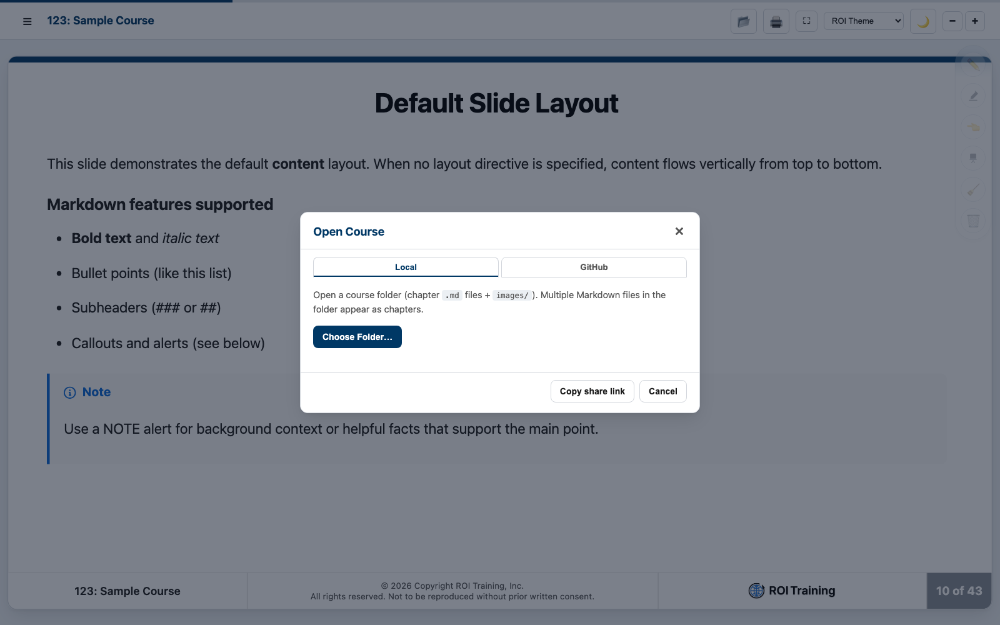

# Create a Short Course on Web Development

## Time Required

90 minutes

## Overview

In this lab, you will start a real course with the ROI Course Factory. You clone the authoring template, brief an agent, approve an outline, and generate the opening of a 3-hour course titled Understanding Web Development with HTML, CSS, and JavaScript. Then you preview those slides in the viewer.

### You learn how to:
- Clone the ROI course authoring template and open it in a coding agent.
- Brief the agent with a title, audience, prerequisites, and course length before it writes slides.
- Review an outline and have the agent write the introduction and the first chapter.
- Preview the new slides in the HTML Slides Viewer.

## Scenario

You just sat through Introducing the ROI Course Factory. Your first assignment is a 3-hour classroom course for people who work with web teams. They need to read a page, sketch a change, and lightly edit HTML, CSS, and JavaScript. They are not in a first-week bootcamp.

You will not hand-write every slide. You will drive the agent, reject a weak draft, and look at the result the way an instructor will.

## Lab Instructions

### Task 1: Clone the template and open it in your agent

In this task, you get a clean copy of the authoring template and open it where your agent can see the skills.

1. Open a terminal in a folder where you keep course work. Do not clone into the Course Factory sample you are reading now.

2. Clone the template:

```bash
git clone https://github.com/roitraining/roi-course-authoring-template.git web-development-course
cd web-development-course
```

3. Open the `web-development-course` folder in your coding agent: Cursor, Claude Code, Visual Studio Code, Antigravity, or another agent that can read skills.

4. Confirm these paths exist before you prompt anything:

```text
.agents/skills/course-generator/SKILL.md
.agents/skills/lab-generator/SKILL.md
course/images/welcome.png
labs/
```

> [!IMPORTANT]
> Work in this new clone. Do not edit the Introducing the ROI Course Factory folder. That sample is the class you are taking, not the course you are creating.

> [!NOTE]
> The template already points common agents at the skills through `.cursorrules`, `CLAUDE.md`, `AGENTS.md`, and the Copilot instructions. If your agent ignores them, say so in the next task.

### Task 2: Brief the agent and demand an outline

In this task, you lock the audience, the prerequisites, and the length before any chapter file exists.

1. Paste this prompt to your agent. Change nothing except the agent name if you need to tell it which skill file to open:

```text
Read .agents/skills/course-generator/SKILL.md and follow it.

Outline a 3-hour course titled
"Understanding Web Development with HTML, CSS, and JavaScript."

Audience: professionals who work with web teams and need to
read, sketch, and lightly change pages. Not a first-week bootcamp.
Prerequisites: files and folders, a text editor, and a current
browser. No prior HTML required.
Length: 3 hours of classroom time, including one short lab.

Do not write chapter files yet. Return:
- the course title
- chapters and their sections
- the lab title and a time estimate

Wait for me to approve the outline.
```

2. Read the outline against this shape. A close match is good. A different story that still fits 3 hours and this audience is also good. Reject an outline that misses the list below.

| Check | What good looks like |
| :--- | :--- |
| Title | Understanding Web Development with HTML, CSS, and JavaScript |
| Size | An introduction plus about two content chapters, not a single giant file and not a four-day catalog |
| Chapter 1 | HTML and CSS: structure, then presentation |
| Chapter 2 | JavaScript in the page: behavior the reader can follow |
| Lab | One lab, about 30 to 45 minutes, named in the outline |
| Altitude | People who will work with a web team, not “install your first browser” |

3. If the outline is off, reply with the specific miss. Do not say “try again” with no detail.

```text
Revise the outline. Keep the title, audience, prerequisites, and 3-hour length.
Chapter 1 must teach HTML structure and CSS presentation.
Chapter 2 must teach JavaScript in the page.
Include one lab with a title and a time.
Do not write chapter files yet.
```

> [!IMPORTANT]
> Do not let the agent write chapter files in this task. An outline you have not read is how a 3-hour course becomes a beginner textbook.

### Task 3: Approve the outline and write the opening

In this task, you turn an approved outline into the introduction and the first chapter only.

1. Reply with an approval that repeats the constraints:

```text
Approved. Using the Course Generator skill, write only:
- course/00-introduction.md
- the Chapter 1 file under course/
- reuse the stock images already in course/images/

Do not write Chapter 2 yet. Do not write the lab manual yet.
The lab stub on the chapter is a title and a time only.
```

2. When the files appear, confirm the introduction order without reading every bullet: title, welcome, course objectives, agenda, who should attend, prerequisites.

3. Confirm Chapter 1 has a title slide, objectives, a navigation slide before each section, and that it stops before Chapter 2.

4. Skim for two authoring faults:

- An ampersand in a title or sentence. Ask the agent to write “and” instead.
- A lab URL on the lab stub. The stub should be a title and a time only.

> [!NOTE]
> Stock images such as `welcome.png` and `agenda.png` should be the files that came with the template. If the agent invented new ones, tell it to reuse `course/images/` instead.

### Task 4: Preview the slides in the viewer

In this task, you look at the draft the way the room will see it.

1. Open the slides viewer at [https://slidesv.roitraining.com/](https://slidesv.roitraining.com/).

2. Click the folder icon, choose **Local**, then **Choose Folder**, and select the `course` folder inside `web-development-course`.



3. Step through the introduction. Check that Welcome, Agenda, Who Should Attend, and Prerequisites show the stock art in the colored panel, not a missing-image icon.

4. Open Chapter 1 from the chapter menu. Click the hamburger and jump to the lab stub. Confirm you see a title and a time, and that you do not see numbered lab steps.

5. Note two slides you would not teach as they stand. You will use them in the bonus task. Write down the slide title and one concrete fix for each (wording, layout, or image).

> [!WARNING]
> The viewer does not save. If you type into the page, you have not edited the course.

### Bonus Task 5: Change one slide in the editor

Use the editor on your clone. Fewer hints this time: you already know the inspector.

1. Open the slide editor in Chrome or Edge and choose the `web-development-course/course` folder.

2. Open Chapter 1. Pick one of the two slides you flagged in Task 4.

3. Change something real: the layout, the wording, or the image. Use **Add image** or **Use** if the fix is a picture. Right-click if you need to duplicate a slide rather than invent one.

4. Save the chapter. Reopen that folder in the viewer and confirm the change is on the stage.


> [!NOTE]
> Save writes the Markdown on your machine. It does not push to GitHub. Commit when you are ready to share the course, not in the middle of a guess.

## Congratulations!

In this lab, you have:
- Cloned the ROI course authoring template and opened it in a coding agent.
- Briefed the agent with a title, audience, prerequisites, and course length before it wrote slides.
- Reviewed an outline and had the agent write the introduction and the first chapter.
- Previewed the new slides in the HTML Slides Viewer.
