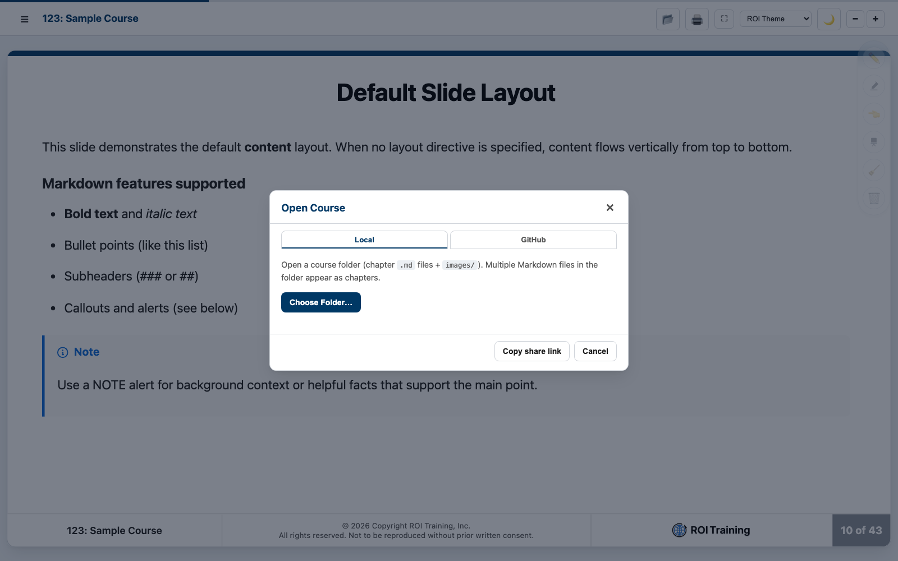

# Create a Short Course on Web Development

## Time Required

20 minutes

## Overview

In this lab, you will clone the ROI course authoring template and hand your agent one prompt. That prompt carries a half-day outline. The agent writes the full course and three short labs.

### You learn how to:
- Clone the ROI course authoring template and open it in a coding agent.
- Ask the agent to build a complete course and three labs from one outline.
- Preview the generated slides in the HTML Slides Viewer.

## Scenario

You just sat through Introducing the ROI Course Factory. Your first assignment is a half-day course, Understanding Web Development with HTML, CSS, and JavaScript, for people who work with web teams. They need to read a page, sketch a change, and lightly edit HTML, CSS, and JavaScript.

You will not hand-write the slides or the labs. One prompt does that work. You watch a full course appear.

## Lab Instructions

### Task 1: Clone the template and open it in your agent

In this task, you get a clean copy of the authoring template and open it where your agent can see the skills.

1. Open a terminal in a folder where you keep course work. 

2. Clone the template:

```bash
git clone https://github.com/roitraining/roi-course-authoring-template.git web-development-course
cd web-development-course
```

3. Open the `web-development-course` folder in your coding agent: Cursor, Claude Code, Visual Studio Code, Antigravity, or another agent that can read skills.

4. Confirm these paths exist before you prompt anything:

```text
.agents/skills/course-generator/SKILL.md
.agents/skills/lab-generator/SKILL.md
course/images/welcome.png
labs/
```

> [!IMPORTANT]
> Work in this new clone. Do not edit the Introducing the ROI Course Factory folder. That sample is the class you are taking, not the course you are creating.

> [!NOTE]
> The template already points common agents at the skills through `.cursorrules`, `CLAUDE.md`, `AGENTS.md`, and the Copilot instructions. If your agent ignores them, the prompt in Task 2 names the skills again.

### Task 2: Build the course and the labs from one outline

In this task, you paste one prompt. The outline is already in it. The agent writes the chapters and the three labs. You do not stop to approve an outline first.

1. In the agent you opened in Task 1, paste this prompt:

```text
Use the Course Generator skill and the Lab Generator skill.
Read both skills and follow them.

Build a complete half-day course and its three labs.
Do not stop after an outline. Write every chapter file and every lab.

Course title: Understanding Web Development with HTML, CSS, and JavaScript
Audience: professionals who work with web teams and need to
read, sketch, and lightly change pages. Not a first-week bootcamp.
Prerequisites: files and folders, a text editor, and a current
browser. No prior HTML required.
Length: half a day, about 4 hours, including three short labs.

Follow this outline.

Introduction
- Title, welcome, objectives, agenda, who should attend, prerequisites

Chapter 1: HTML and the Structure of a Page
- Documents and elements
- Text, links, and images
- How a page is organized
Lab: Build a Simple Page (20 minutes)

Chapter 2: CSS and How the Page Looks
- Selectors and the cascade
- The box model and simple layout
- Type, color, and spacing
Lab: Style the Page (20 minutes)

Chapter 3: JavaScript and Behavior in the Browser
- Finding elements on the page
- Responding to events
- Reading and changing what the visitor sees
Lab: Make the Page Respond (20 minutes)

Write these files:
- course/00-introduction.md
- one Markdown file per chapter under course/
- labs/lab-01-build-a-simple-page/lab.md
- labs/lab-02-style-the-page/lab.md
- labs/lab-03-make-the-page-respond/lab.md

Reuse the stock images already in course/images/.
On each chapter, the lab stub is a title and a time only.
```

2. Let the agent finish. It should create the introduction, three chapter files, and three lab folders.

3. In the file tree, confirm `course/` has the introduction and three chapter files, and `labs/` has three lab folders, each with a `lab.md`.

> [!NOTE]
> This is the whole authoring step. The outline in the prompt is what keeps a one-shot draft on a half-day story instead of a four-day catalog.

### Task 3: Preview the course the agent just wrote

In this task, you open the new slides the way an instructor will.

1. Open the slides viewer at [https://slidesv.roitraining.com/](https://slidesv.roitraining.com/).

2. Click the folder icon, choose **Local**, then **Choose Folder**, and select the `course` folder inside `web-development-course`.



3. Use the chapter menu. Confirm you can open the introduction and all three chapters.

4. On one chapter, jump to the lab stub. Confirm it shows a title and a time.

5. Open `labs/lab-01-build-a-simple-page/lab.md` in your editor. Confirm it has an overview, numbered tasks, and a closing. Skim the other two labs the same way.

> [!WARNING]
> The slides viewer does not save. If you type into the page, you have not edited the course.

## Congratulations!

In this lab, you have:
- Cloned the ROI course authoring template and opened it in a coding agent.
- Asked the agent to build a complete course and three labs from one outline.
- Previewed the generated slides in the HTML Slides Viewer.
