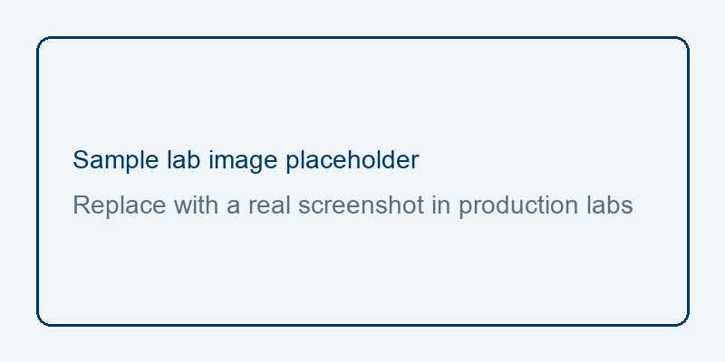

# Sample Lab: Explore the Lab Viewer Format

## Overview

In this short sample lab, you practice the Markdown patterns used by ROI hands-on labs: objectives, numbered tasks, fenced commands, and optional screenshots. Use this file as a reference when drafting real labs with the Lab Generator skill.

## Objectives

In this lab, you learn how to:

- Recognize the required lab section order.
- Write numbered tasks with copyable commands.
- Reference images from an `images/` folder beside the lab manual.

## Prerequisites

- Ability to edit Markdown in your course authoring repo.
- Access to the HTML Lab Viewer for preview.

## Setup

1. Open this repository in your editor.
2. Locate this folder: `labs/lab-01-sample-lab-viewer-format/`.
3. Keep `README.md` and `images/` together when you copy the pattern for a new lab.

## Task 1. Preview the lab in the Lab Viewer

In this task, you open the lab manual in the HTML Lab Viewer.

1. Push your repo to GitHub (or use a raw Markdown URL you can fetch).
1. Open the Lab Viewer and pass this lab with the `lab` query parameter (folder URL or raw `README.md` URL).
1. Confirm the table of contents lists Overview, Objectives, Tasks, and Congratulations.

> [!NOTE]
> If you point the viewer at a folder URL, it loads `README.md` by default.

## Task 2. Add a placeholder screenshot reference

In this task, you see how images are linked for the viewer.

1. Notice that screenshot paths are relative to this file:

```markdown

```

1. Replace placeholders with real UI captures when authoring production labs.
1. Always include meaningful alt text.

<!-- TODO IMAGE: Optional small diagram illustrating lab folder layout -->


## Congratulations!

You reviewed the ROI lab manual shape used with the HTML Lab Viewer. Copy `labs/lab-NN-slug/README.md` plus an `images/` folder for each new lab, and follow `.agents/skills/lab-generator/SKILL.md` when generating content.
